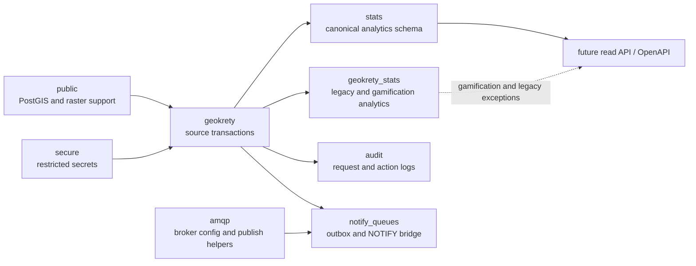

# GeoKrety Database Specs

This site is now the authoritative database reference for the current GeoKrety Stats branch. It describes what exists in the live schemas, how the March 2026 migration chain changed the system, which source-side triggers feed analytics, and how to operate or extend the platform safely.

## Start here

- [Schema hub](specs.md)
- [Stats schema](specs.stats.md)
- [GeoKrety source schema](specs.geokrety.md)
- [Legacy and gamification analytics](specs.geokrety_stats.md)

The default contract for future read APIs is `stats`. The `geokrety_stats` schema remains important, but mainly for points, leaderboards, and legacy read models.

## What changed on this branch

The branch starting at `20260310100100_create_stats_schema.php` established `stats` as the canonical analytics schema and then layered on:

- exact sharded counters and daily rollups
- country rollups and temporal country history
- waypoint registry and relationship surfaces
- milestone and first-finder event analytics
- snapshot orchestration, resumable backfill support, and materialized read models
- late-stage performance work on `gk_moves` indexing and scoped backfills
- live reconciliation hardening for first-finder correctness

## Historical material

The material in [docs/database-refactor/00-SPRINT-INDEX.md](database-refactor/00-SPRINT-INDEX.md) is still useful, but it should now be read as implementation history and design notes. The `docs/specs*.md` pages are the current contract.
