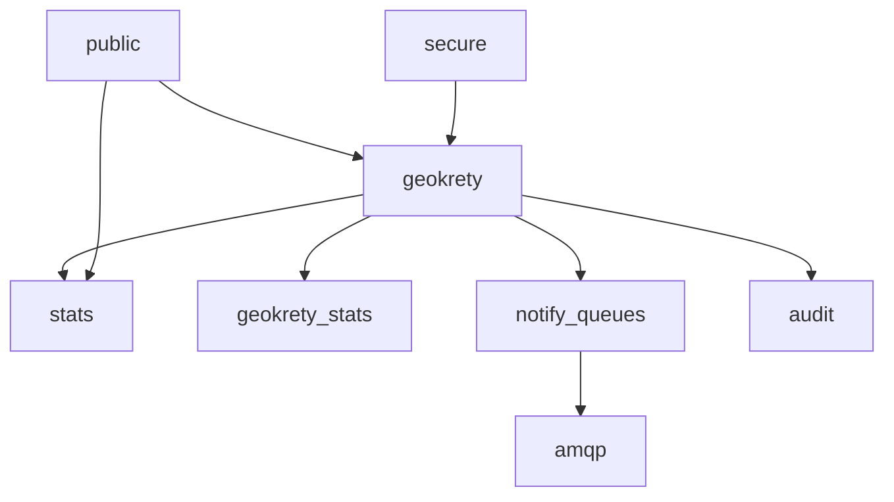

# Schema Hub

This section documents the live PostgreSQL schemas that matter for GeoKrety Stats. The pages are written for both operators and implementers: they describe table purpose, dependencies, maintenance rules, example usage patterns, and where the current branch changed behavior.

## Table of contents

- [Scope](#scope)
- [Schema map](#schema-map)
- [Pages](#pages)
- [Migration chain covered](#migration-chain-covered)
- [Operational baseline](#operational-baseline)
- [Historical references](#historical-references)

## Scope

The reference covers these live schemas:

- `stats`: canonical analytics schema introduced and expanded by the March 2026 branch
- `geokrety`: transactional source schema and source-owned trigger layer
- `public`: shared PostGIS and raster support objects
- `amqp`: broker connection configuration
- `audit`: action and request logs
- `notify_queues`: outbox queue and PostgreSQL `NOTIFY` bridge
- `secure`: sensitive key storage
- `geokrety_stats`: legacy and gamification analytics surfaces still present in the live database

## Schema map

## Pages

- Canonical analytics: [stats](specs.stats.md)
- Source contract: [geokrety](specs.geokrety.md)
- Support schemas: [public](specs.public.md), [audit](specs.audit.md), [notify_queues](specs.notify_queues.md), [amqp](specs.amqp.md), [secure](specs.secure.md)
- Legacy and gamification: [geokrety_stats](specs.geokrety_stats.md)

## Migration chain covered

This reference inspects the branch from `20260310100100_create_stats_schema.php` through `20260316133000_harden_first_finder_live_reconciliation.php`.

The chain introduced or changed these domains:

- stats schema creation and privileges
- `gk_moves` lineage columns and chain repair functions
- operational tracking tables and resumable jobs
- daily activity and sharded counters
- country analytics and history
- waypoint and relationship analytics
- event surfaces and materialized views
- runtime index tuning for backfill and scoped rebuilds
- full snapshot backfills for tables added late in the branch
- first-finder live reconciliation hardening

## Operational baseline

Observed from the live development database during documentation generation:

- PostgreSQL `16.3`
- TimescaleDB extension currently not installed
- `geokrety.gk_moves` estimated at roughly `6.9M` rows and `17 GB`
- `stats.mv_backfill_working_set` estimated at roughly `6.9M` rows and `1.2 GB`
- `stats.first_finder_events` currently `4421` rows
- `stats.gk_milestone_events` currently `123678` rows

## Historical references

Keep these for design history, not as the current contract:

- [Sprint index](../database-refactor/00-SPRINT-INDEX.md)
- [Runbook](../database-refactor/RUNBOOK.md)
- [Performance notes](../database-refactor/PERFORMANCE.md)
