# `stats` schema

The `stats` schema is the canonical analytics surface introduced by the March 2026 migration chain. It is intentionally separate from the transactional `geokrety` schema, but most live maintenance still starts from source-side triggers on `geokrety.gk_moves`, `geokrety.gk_geokrety`, `geokrety.gk_pictures`, `geokrety.gk_loves`, and `geokrety.gk_users`.

## Table of contents

- [Role and boundaries](#role-and-boundaries)
- [Migration timeline](#migration-timeline)
- [Live footprint](#live-footprint)
- [Schema diagram](#schema-diagram)
- [Object inventory](#object-inventory)
- [Live maintenance contract](#live-maintenance-contract)
- [Snapshot and backfill commands](#snapshot-and-backfill-commands)
- [Example patterns](#example-patterns)
- [TimescaleDB enablement plan](#timescaledb-enablement-plan)
- [Maintenance and cron guidance](#maintenance-and-cron-guidance)
- [OpenAPI and product planning](#openapi-and-product-planning)

## Role and boundaries

The schema serves four purposes:

- exact online aggregates that are cheap to read
- snapshot tables that compress historical trends
- reusable read models and materialized views for future APIs
- operational state for long-running resumable rebuilds

The main boundary is simple: writes originate from `geokrety`, while `stats` stores analytics state. Cross-schema FKs are used sparingly on purpose. Several tables store `gk_id` or `user_id` without hard foreign keys to avoid locking and deploy-order problems.

## Migration timeline

The current branch materially changed `stats` in this order:

1. `20260310100100_create_stats_schema.php`: creates the schema and baseline ownership.
2. `20260310100105_add_gk_moves_source_columns.php`: adds `previous_move_id`, `previous_position_id`, and `km_distance` lineage support in `geokrety.gk_moves`.
3. `20260310100110_previous_move_backfill_chain.php`: adds repair and backfill functions for move lineage.
4. `20260310200000_create_stats_daily_foundations.php`: creates `daily_activity`, `daily_active_users`, and base daily aggregation helpers.
5. `20260310200100_create_counter_live_maintenance.php`: introduces `entity_counters_shard` and live counters.
6. `20260310200200_create_counter_snapshot_and_seed_functions.php`: adds `daily_entity_counts` snapshots and seeders.
7. `20260310300000_create_country_stats_tables.php`: creates country rollup tables.
8. `20260310300400_create_country_stats_maintenance.php`: adds live rollup and country-history maintenance.
9. `20260310400000_create_waypoint_registry.php`: adds canonical waypoint registry.
10. `20260310400400_create_waypoint_relationship_tables.php`: adds cache and relationship tables.
11. `20260310400700_create_waypoint_relationship_triggers.php`: wires live maintenance from `gk_moves`.
12. `20260310401000_create_waypoint_snapshot_functions.php`: adds snapshot rebuilds for relationship domains.
13. `20260310500000_create_analytics_event_surface.php`: creates `hourly_activity`, `country_pair_flows`, `gk_milestone_events`, and `first_finder_events`.
14. `20260310600400_create_snapshot_orchestration_and_views.php`: adds orchestration functions, use-case views, `job_log`, and `backfill_progress`.
15. `20260310600600_create_materialized_views.php`: adds materialized read models.
16. `20260310600700_add_snapshot_runtime_indexes.php`: adds runtime indexes supporting snapshot and repair workloads.
17. `20260314101000_remove_redundant_gk_moves_indexes.php`: removes overlapping source indexes after planner validation.
18. `20260315171920_add_scoped_snapshot_backfill_indexes.php`: adds concurrent history indexes for targeted rebuilds.
19. `20260316123000_backfill_missing_snapshot_tables.php`: adds full rebuild functions for late snapshot tables.
20. `20260316133000_harden_first_finder_live_reconciliation.php`: fixes live first-finder drift by reconciling the canonical winner instead of append-only insertion.

## Live footprint

Observed from the live development database:

- `stats.mv_backfill_working_set`: about `6.9M` rows, `1.2 GB`
- `stats.gk_cache_visits`: about `6.35M` rows, `1.4 GB`
- `stats.user_related_users`: about `779k` rows, `464 MB`
- `stats.daily_entity_counts`: about `168k` rows, `16 MB`
- `stats.first_finder_events`: `4421` rows
- `stats.gk_milestone_events`: `123678` rows
- `stats.gk_country_history`: `238127` rows

## Schema diagram

```mermaid
erDiagram
    continent_reference ||--o{ user_countries : maps
    continent_reference ||--o{ country_daily_stats : normalizes
    waypoints ||--o{ gk_cache_visits : references
    waypoints ||--o{ user_cache_visits : references

    daily_activity {
        date activity_date PK
    }
    daily_active_users {
        date activity_date PK
        int user_id PK
    }
    entity_counters_shard {
        varchar entity PK
        int shard PK
        bigint cnt
    }
    daily_entity_counts {
        date count_date PK
        varchar entity PK
        bigint cnt
    }
    country_daily_stats {
        date stats_date PK
        char country_code PK
    }
    gk_country_history {
        bigint id PK
        int geokrety_id
        char country_code
        timestamptz arrived_at
        timestamptz departed_at
    }
    waypoints {
        bigint id PK
        varchar waypoint_code
        char source
    }
    gk_cache_visits {
        int gk_id PK
        bigint waypoint_id PK
        bigint visit_count
    }
    user_cache_visits {
        int user_id PK
        bigint waypoint_id PK
        bigint visit_count
    }
    gk_related_users {
        int geokrety_id PK
        int user_id PK
        bigint interaction_count
    }
    user_related_users {
        int user_id PK
        int related_user_id PK
        bigint shared_geokrety_count
    }
    gk_milestone_events {
        bigint id PK
        int gk_id
        text event_type
        timestamptz occurred_at
    }
    first_finder_events {
        int gk_id PK
        int finder_user_id
        bigint move_id
    }
    job_log {
        bigint id PK
        varchar job_name
        varchar status
    }
    backfill_progress {
        varchar job_name PK
        bigint cursor_id
        varchar status
    }
```



## Object inventory

### Operational tables

- `backfill_progress`: cursor and liveness state for resumable heavy jobs.
- `job_log`: append-only execution log for snapshots, replay, and runner markers.

### Reference tables

- `continent_reference`: ISO country to continent mapping.
- `waypoints`: canonical deduplicated waypoint registry.

### Daily and counter surfaces

- `daily_activity`: exact daily totals across moves, pictures, loves, registrations, and created GKs.
- `daily_active_users`: presence table used to compute exact daily active users.
- `entity_counters_shard`: 16-shard exact counters for hot entities.
- `daily_entity_counts`: daily cumulative snapshots of the 25 canonical entity counters.

The 25 canonical entities are:

- `gk_moves`, `gk_moves_type_0`, `gk_moves_type_1`, `gk_moves_type_2`, `gk_moves_type_3`, `gk_moves_type_4`, `gk_moves_type_5`
- `gk_geokrety`, `gk_geokrety_type_0`, `gk_geokrety_type_1`, `gk_geokrety_type_2`, `gk_geokrety_type_3`, `gk_geokrety_type_4`, `gk_geokrety_type_5`, `gk_geokrety_type_6`, `gk_geokrety_type_7`, `gk_geokrety_type_8`, `gk_geokrety_type_9`, `gk_geokrety_type_10`
- `gk_pictures`, `gk_pictures_type_0`, `gk_pictures_type_1`, `gk_pictures_type_2`
- `gk_users`
- `gk_loves`

### Country analytics

- `country_daily_stats`: daily per-country aggregates.
- `gk_countries_visited`: first-visit country registry per GK.
- `user_countries`: per-user country history summary.
- `gk_country_history`: interval-based GK country residency history.
- `country_pair_flows`: monthly cross-border transitions.

### Waypoint and relationship analytics

- `gk_cache_visits`: per-GK waypoint visit counts.
- `user_cache_visits`: per-user waypoint visit counts.
- `gk_related_users`: per-GK interacting-user surface.
- `user_related_users`: directional shared-GK user graph.

### Event analytics

- `hourly_activity`: move counts by UTC day, hour, and move type.
- `gk_milestone_events`: one row per GK per milestone type.
- `first_finder_events`: canonical first non-owner qualifying interaction within 168 hours.

### Materialized views

- `mv_backfill_working_set`: heavy precomputed lineage state for backfills.
- `mv_country_month_rollup`: thin materialized proxy over country flows.
- `mv_global_kpi`: singleton global KPI snapshot.
- `mv_top_caches_global`: global cache popularity ranking.

### Read views

- `v_waypoints_source_union`: raw union of GC and OC waypoint sources.
- `v_uc1_country_activity`, `v_uc2_user_network`, `v_uc3_gk_circulation`, `v_uc4_user_continent_coverage`, `v_uc6_dormancy`, `v_uc7_country_flow`, `v_uc8_seasonal_heatmap`, `v_uc9_multiplier_velocity`, `v_uc10_cache_popularity`, `v_uc13_gk_timeline`, `v_uc14_first_finder_hof`, `v_uc15_distance_records`.

### Operational routines

- `fn_run_snapshot_phase` and `fn_run_all_snapshots`: orchestration entry points.
- `fn_snapshot_daily_entity_counts`, `fn_snapshot_gk_country_history`, `fn_snapshot_first_finder_events`, `fn_snapshot_gk_milestone_events`: full rebuild functions for late snapshot tables.
- `fn_backfill_previous_move_id` and `fn_backfill_heavy_previous_move_id_all`: lineage repair and heavy backfill entry points.
- `fn_detect_first_finder` and `fn_reconcile_first_finder_event`: first-finder detection and canonical per-GK reconciliation.

## Live maintenance contract

`stats` is not self-sufficient. These source-owned trigger families maintain it:

- `geokrety.fn_gk_moves_daily_activity()`: daily activity and daily active users.
- `geokrety.fn_gk_moves_sharded_counter()`: exact hot counters.
- `geokrety.fn_gk_geokrety_counter()`, `geokrety.fn_gk_pictures_counter()`, `geokrety.fn_gk_users_counter()`, `geokrety.fn_gk_loves_activity()`: non-move sources.
- `geokrety.fn_gk_moves_country_rollups()`: `country_daily_stats`.
- `geokrety.fn_gk_moves_country_history()`: `gk_country_history`, `gk_countries_visited`, and `user_countries`.
- `geokrety.fn_gk_moves_waypoint_cache()`: waypoint and cache visit surfaces.
- `geokrety.fn_gk_moves_relations()`: `gk_related_users` and `user_related_users`.
- `geokrety.fn_gk_moves_milestones()`: `gk_milestone_events` for non-first-finder thresholds.
- `geokrety.fn_gk_moves_first_finder()` and `geokrety.fn_gk_geokrety_first_finder()`: canonical first-finder reconciliation.

The late hardening is important: `stats.fn_reconcile_first_finder_event(p_gk_id)` recomputes the canonical winner and updates both `first_finder_events` and `gk_milestone_events(event_type = 'first_find')`. This fixed the earlier append-only behavior where a later-inserted but earlier-dated move could not replace a stale winner.

## Snapshot and backfill commands

The authoritative runner is `docs/database-refactor/run_snapshot_backfill.py`.

### Operator run sequence

Run from the `geokrety-stats` repository root with PostgreSQL access already configured for `psycopg2`.

Use the runner in three modes:

1. Planning with `--dry-run`.
2. Repair or bootstrap rebuild with resume enabled unless there is a strong reason to disable it.
3. Validation by checking `stats.job_log`, counter totals, and first-finder parity after the run.

The full historical runner is primarily a repair or bootstrap tool. Because `stats` is maintained synchronously by source-side triggers, routine operations should prefer validation plus targeted rebuilds over recurring full-history snapshots.

Typical full rebuild:

```bash
python docs/database-refactor/run_snapshot_backfill.py \
  --start 2007-10 \
  --end 2026-03-16 \
  --batch-size 50000
```

Plan only:

```bash
python docs/database-refactor/run_snapshot_backfill.py \
  --start 2007-10 \
  --end 2026-03-16 \
  --dry-run
```

Replay without resume markers:

```bash
python docs/database-refactor/run_snapshot_backfill.py \
  --start 2007-10 \
  --end 2026-03-16 \
  --no-resume
```

Delete only the runner-owned markers for the exact resolved run key and start clean:

```bash
python docs/database-refactor/run_snapshot_backfill.py \
  --start 2007-10 \
  --end 2026-03-16 \
  --clear-resume-markers
```

Disable parallel month phases for diagnostics:

```bash
python docs/database-refactor/run_snapshot_backfill.py \
  --start 2024-01 \
  --end 2024-12 \
  --no-parallel
```

Phase notes:

- full-only phases include `fn_snapshot_entity_counters`, `fn_snapshot_daily_entity_counts`, `fn_snapshot_gk_country_history`, `fn_snapshot_first_finder_events`, and `fn_snapshot_gk_milestone_events`
- replica-role mode applies only to the four table-rebuild phases: `fn_snapshot_daily_entity_counts`, `fn_snapshot_gk_country_history`, `fn_snapshot_first_finder_events`, and `fn_snapshot_gk_milestone_events`; it does not apply to `fn_snapshot_entity_counters`
- replica-role mode is only safe for isolated maintenance-window or offline rebuild work because it suppresses user triggers and other business-side effects for the session
- exact-run resume markers are stored in `stats.job_log` using `job_name = 'run_snapshot_backfill_step'`

## Example patterns

Examples below use live-observed shapes and ranges, but identifiers and values are obfuscated.

### Daily entity counts

Observed latest snapshot date: `2026-03-15`.

```text
count_date   entity              cnt
2026-03-15   gk_moves        6,905,437
2026-03-15   gk_geokrety       108,423
2026-03-15   gk_users           36,389
2026-03-15   gk_pictures        68,920
```

### Move type distribution

Observed live distribution shows `move_type = 5` dominating volume, with roughly `6.25M` rows, while drop, grab, comment, seen, and archive are materially smaller.

An obfuscated row shape looks like:

```json
{
  "move_id": 6900001,
  "geokret": 108000,
  "move_type": 5,
  "moved_on_datetime": "2026-02-2xT18:1x:00Z",
  "previous_move_id": 6899990,
  "previous_position_id": 6899980,
  "km_distance": 12.347
}
```

### First finder

Current live row count is `4421`. Canonical first-finder eligibility is:

- author must be authenticated
- move type must be one of `0`, `1`, `3`, or `5`
- author must differ from owner
- move time must be within `168 hours` of GK creation
- earliest qualifying `(moved_on_datetime, id)` wins

Obfuscated example:

```json
{
  "gk_id": 10xxxx,
  "finder_user_id": 3xxxx,
  "move_id": 68xxxxx,
  "move_type": 0,
  "hours_since_creation": 14,
  "found_at": "2026-02-2xT09:1x:00Z"
}
```

## TimescaleDB enablement plan

TimescaleDB is not installed on the inspected live development database. The current schema is written so that adoption remains optional.

### Good candidates

- `stats.daily_activity`
- `stats.daily_entity_counts`
- `stats.country_daily_stats`
- `stats.hourly_activity`
- optionally `stats.country_pair_flows` if monthly flow queries become heavy enough

### Poor candidates or keep as plain PostgreSQL

- `stats.entity_counters_shard`: tiny hot-write table
- `stats.waypoints`: reference table
- `stats.gk_cache_visits`, `stats.user_cache_visits`, `stats.gk_related_users`, `stats.user_related_users`: relationship surfaces keyed by entities, not by time
- `stats.gk_country_history`: temporal exclusion constraint makes conversion riskier and offers less value
- `stats.first_finder_events` and `stats.gk_milestone_events`: modest event tables with strong business uniqueness rules

### Enablement commands

Run only after extension packaging and maintenance window approval.

```sql
CREATE EXTENSION IF NOT EXISTS timescaledb;

SELECT create_hypertable(
    'stats.daily_activity',
    by_range('activity_date'),
    chunk_time_interval => INTERVAL '90 days',
    migrate_data => TRUE,
    if_not_exists => TRUE
);

SELECT create_hypertable(
    'stats.daily_entity_counts',
    by_range('count_date'),
    chunk_time_interval => INTERVAL '180 days',
    migrate_data => TRUE,
    if_not_exists => TRUE
);

SELECT create_hypertable(
    'stats.country_daily_stats',
    by_range('stats_date'),
    chunk_time_interval => INTERVAL '90 days',
    migrate_data => TRUE,
    if_not_exists => TRUE
);

SELECT create_hypertable(
    'stats.hourly_activity',
    by_range('activity_date'),
    chunk_time_interval => INTERVAL '30 days',
    migrate_data => TRUE,
    if_not_exists => TRUE
);
```

### After conversion

- re-run `ANALYZE` on each converted hypertable
- benchmark the use-case views against representative API queries
- keep `mv_backfill_working_set` as plain materialized view unless a later redesign replaces it entirely
- do not convert `gk_country_history` until exclusion-constraint semantics and retention needs are explicitly revisited

### Optional policies once installed

```sql
SELECT add_compression_policy('stats.hourly_activity', INTERVAL '180 days');
SELECT add_retention_policy('stats.hourly_activity', INTERVAL '5 years');
```

Only add retention after product and reporting requirements confirm that raw history older than the policy window can be dropped.

## Maintenance and cron guidance

Recommended scheduled work, not yet a guaranteed existing production cron set:

1. Nightly validation and light refresh, not a full historical rebuild.

- inspect `stats.job_log` for recent errors
- compare `sum(cnt)` in `entity_counters_shard` with source counts
- verify first-finder parity against the canonical source query
- refresh materialized views as needed for reporting freshness

2. Targeted repair after bulk work or detected drift.

```bash
python docs/database-refactor/run_snapshot_backfill.py --start 2026-01 --end 2026-04
```

3. Materialized-view refresh after targeted rebuilds or on scheduled reporting windows.

```sql
REFRESH MATERIALIZED VIEW CONCURRENTLY stats.mv_country_month_rollup;
REFRESH MATERIALIZED VIEW CONCURRENTLY stats.mv_top_caches_global;
REFRESH MATERIALIZED VIEW CONCURRENTLY stats.mv_global_kpi;
```

If a future materialized view lacks the required unique index, treat refresh as a maintenance-window operation and document the lock implication explicitly.

4. Weekly health checks.

- compare `sum(cnt)` in `entity_counters_shard` with source counts
- compare `stats.first_finder_events` against canonical source query
- inspect `stats.job_log` for recent `status = 'error'`
- monitor `mv_backfill_working_set` refresh duration and bloat

5. Weekly or post-bulk-load maintenance.

```sql
VACUUM (ANALYZE) stats.daily_activity;
VACUUM (ANALYZE) stats.daily_entity_counts;
VACUUM (ANALYZE) stats.country_daily_stats;
VACUUM (ANALYZE) stats.gk_country_history;
VACUUM (ANALYZE) stats.gk_milestone_events;
```

## OpenAPI and product planning

### Read API proposal

The best first API is read-only and backed by `stats` views and materialized views.

Candidate contract map:

| Endpoint | Backing object | Freshness | Key parameters | Intentionally excluded |
| --- | --- | --- | --- | --- |
| `GET /api/stats/global-kpi` | `stats.mv_global_kpi` | materialized; expose `computed_at` | none | internal job state |
| `GET /api/stats/countries` | `stats.v_uc1_country_activity` | near-live | optional continent filter | per-user internals |
| `GET /api/stats/countries/{countryCode}` | `stats.country_daily_stats` and `stats.v_uc7_country_flow` | near-live plus monthly rollup freshness | `countryCode`, date window | raw trigger metadata |
| `GET /api/stats/leaderboards/first-finders` | `stats.v_uc14_first_finder_hof` | near-live | pagination | private profile fields |
| `GET /api/stats/geokrety/{gkId}/timeline` | `stats.v_uc13_gk_timeline` | near-live | `gkId` | unstable internal JSON keys |
| `GET /api/stats/caches/top` | `stats.mv_top_caches_global` | materialized | pagination | raw source-union rows |
| `GET /api/stats/flows` | `stats.v_uc7_country_flow` | near-live or materialized summary | `from`, `to`, `month` | repair metadata |

Swagger design rules:

- expose only stable view-like contracts, not internal maintenance tables
- represent dates as UTC ISO 8601 strings
- document freshness for materialized-view backed endpoints as part of the contract
- include `data_as_of` and `computed_at` fields in responses
- hide implementation tables such as `backfill_progress` and `job_log` from public endpoints

### GeoKrety stats website suggestions

The branch now supports a dedicated stats site with these sections:

- global dashboard: total GKs, moves, kilometers, active countries, and recent milestones
- country explorer: map, monthly flows, activity ranking, and recent trend spark lines
- GeoKret explorer: timeline, first finder, distance milestones, country history, and cache popularity
- community graphs: user network, first-finder hall of fame, continent coverage, and dormancy watchlists

The safest implementation path is a read-only API backed by `stats` plus a frontend that treats refresh timestamps as part of the product, not an implementation detail.
